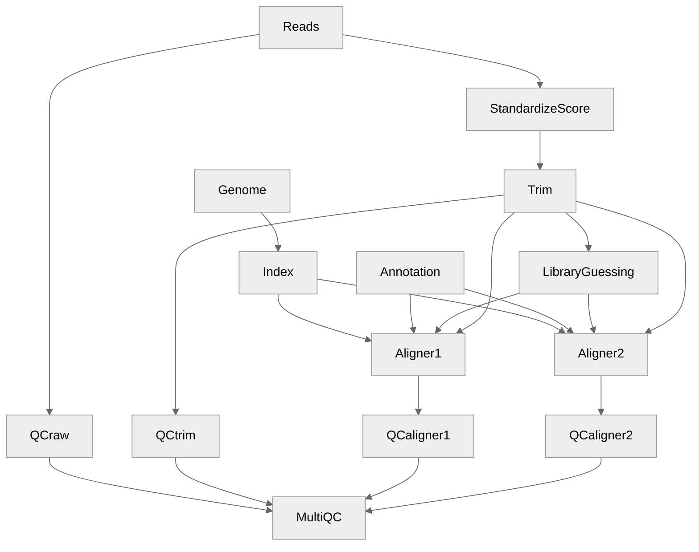

AliNe (Alignment in Nextflow) 
=========================================  
 

AliNe is a pipeline written in Nextflow that aims to efficiently align reads against a reference genome using the tools of your choice.  

## Table of Contents

   * [Foreword](#foreword)
      * [Aligner and read types accepted](#aligner-and-read-types-accepted) 
      * [Aligner and library types accepted](#aligner-and-library-types-accepted)   
      * [Aligner and annotation](#aligner-and-annotation)
   * [Flowchart](#flowchart)
   * [Installation](#installation)
      * [AliNe](#aline)
      * [Nextflow](#nextflow)
      * [Container platform](#container-platform)
        * [Docker](#docker)
        * [Singularity](#singularity)  
   * [Usage and test](#usage)
   * [Parameters](#parameters)
   * [Uninstall](#uninstall)

## Foreword

AliNe is a pipeline written in Nextflow that aims to efficiently align reads against a reference genome.  

 * Can handle short reads paired or single, pacbio and ont (nanopore) data (see list of aligner in [Table 1](#aligner-and-read-types-accepted)).
 * A QC with FastQC is made at each step if option activated.  
 * A trimming is feasible before alignment if option activated.
 * **The pipeline deals automatically with all quality encoding ('sanger', 'solexa', 'illumina-1.3+', 'illumina-1.5+', 'illumina-1.8+').** All fastq will be standardised in Phred+33 for downstream alignments by seqkit.
 * Deal automatically with the type of library used: stranded or not, firstrand, secondstrand etc... (see list of aligner in [Table 2](#aligner-and-library-types-accepted)) 
 * Can deal with annotation file (see list of aligner in [Table 3](#aligner-and-annotation)) 
You can choose to run one or several aligner in parallel.

### Aligner and read types accepted

**Table 1** Here is the list of implemented aligners and the type of reads accepted:

| Tool	| Single End (short reads) | Paired end (short reads) | Pacbio | ONT |
| --- | --- | --- |  --- | --- |
| bbmap | ✅ | ✅ | ⚠️ | ⚠️ |
| bowtie2 | ✅ | ✅ | ⚠️ | ⚠️ |
| bwaaln | ✅ | ✅ R1 and R2 independently aligned then merged with bwa sampe | ✅ | ✅ |
| bwamem | ✅ | ✅ | ⚠️ | ⚠️ |
| bwasw | ✅ | ✅ | ⚠️ | ⚠️ |
| graphmap2 | ⚠️ | ⚠️ R1 and R2 independently aligned then merged with cat | ✅ | ✅ |
| hisat2 | ✅ | ✅ | ⚠️ | ⚠️ |
| minimap2 | ⚠️ | ⚠️ | ✅ | ✅ |
| ngmlr | ⚠️ | 🚫 | ✅ | ✅ |
| novoalign | ✅ | ✅ | ✅ | ⚠️ |
| nucmer | ✅ | ✅ R1 and R2 are concatenated then aligned | ⚠️ | ⚠️ |
| star | ✅ | ✅ | ⚠️ | ⚠️ |
| star 2pass mode | ✅ | ✅ | ⚠️ | ⚠️ |
| subread | ✅ | ✅ | ⚠️ | ⚠️ |
| sublong | ⚠️ | 🚫 | ✅ | ✅ |
| tophat | ✅ | ✅ | 🚫 | 🚫 |

*Legend*  
✅ Recommended  
⚠️ Not recommended - It works but results might be sub-optimal (computing ressources might also be)  
🚫 Not applicable  

It is possible to bypass the default authorized read type using the AliNe --relax parameter.

### Aligner and library types accepted

The pipeline deals automatically with the library types. It extract 10 000 reads by default and run salmon to guess the library type. 
It is then translated to the correct option in the following aligners:

| Tool	| tool option | Library type by salmon | Comment | 
| --- | --- | --- | --- |
| bbmap | xs=fr / xs=ss / xs=us | ISF ISR / OSF OSR / U | strand information |
| bbmap | - / rcs=f / | ISF ISR IU / OSF OSR OU MSF MSR MU | read orientation |
| bowtie2 | --fr / --rf / --ff |  ISF ISR IU / OSF OSR OU / MSF MSR MU| read orientation |
| bwaaln | 🚫 | 🚫 | 🚫 |
| bwamem | 🚫 | 🚫 | 🚫 |
| bwasw | 🚫 | 🚫 | 🚫 |
| graphmap2 | 🚫 | 🚫 | 🚫 |
| hisat2 | --rna-strandness [ F / R / FR / RF ] | SF / SR / ISF OSF MSF / ISR OSR MSR | strand information |
| hisat2 | --fr / --rf / --ff | I / O / M | read orientation |
| minimap2 | 🚫 | 🚫 | 🚫 |
| ngmlr | 🚫 | 🚫 | 🚫 |
| novoalign | 🚫 | 🚫 | 🚫 |
| nucmer | 🚫 | 🚫 | 🚫 |
| star | 🚫 | 🚫 | 🚫 |
| star 2pass mode | 🚫 | 🚫 | 🚫 |
| subread | -S fr / -S rf / -S ff | ISF ISR IU / OSF OSR OU / MSF MSR MU | read orientation |
| sublong | 🚫 | 🚫 | 🚫 |
| tophat2 | fr-unstranded / fr-firststrand / fr-secondstrand | U / SR / SF | strand information |

*Legend*  
U unstranded; SR stranded reverse; SF stranded forward; IU inward unstranded; OU outward unstranded; MU matching unstranded; ISF inward stranded forward; ISR inward stranded reverse; OSF outward stranded forward; OSR outward stranded reverse; MSF matching stranded forward; MSR matching stranded reverse ([see herefor morde details](https://salmon.readthedocs.io/en/latest/library_type.html))  
🚫 Not applicable  

If the skip_libray_usage paramater is set the information provided about the library type provided by the user or guessed by the pipeline via the --library_type parameter is not used.
/!\ If you provide yourself the librairy type via the aligner parameter, it will be used over the information provided or guessed via --library_type.

### Aligner and annotation

If you provide an annotation file the pipeline will pass automatically the file to the following aligner:  

| Tool	| accept | 
| --- | --- | 
| bbmap | na | 
| bowtie2 | na |
| bwaaln | na |
| bwamem | na |
| bwasw | na |
| graphmap2 | GTF (--gtf)  |
| hisat2 | na |
| minimap2 | na |
| ngmlr | na |
| novoalign | na |
| nucmer | na |
| star | GTF / GFF ( --sjdbGTFfile + --sjdbGTFtagExonParentTranscript Parent in case of GFF ) |
| star 2pass mode | GTF / GFF (--sjdbGTFfile + --sjdbGTFtagExonParentTranscript Parent in case of GFF ) |
| subread | GTF or compatible GFF format (-a) |
| sublong | na |
| tophat | GTF/GFF3 (-G) | 
 

## Flowchart



## Installation

The prerequisites to run the pipeline are:  

  * The AliNe repository
  * [Nextflow](https://www.nextflow.io/)  >= 22.04.0
  * [Docker](https://www.docker.com) or [Singularity](https://sylabs.io/singularity/)  

### AliNe 

```bash
# clone the workflow repository
git clone https://github.com/Juke34/AliNe.git

# Move in it
cd AliNe
```

### Nextflow 

  * Via conda 

    <details>
      <summary>See here</summary>
      ```
      conda create -n nextflow
      conda activate nextflow
      conda install nextflow
      ```  
    </details>

  * Manually
    <details>
      <summary>See here</summary>
       Nextflow runs on most POSIX systems (Linux, macOS, etc) and can typically be installed by running these commands:

      ```
      # Make sure 11 or later is installed on your computer by using the command:
      java -version

      # Install Nextflow by entering this command in your terminal(it creates a file nextflow in the current dir):
      curl -s https://get.nextflow.io | bash 

      # Add Nextflow binary to your user's PATH:
      mv nextflow ~/bin/
      # OR system-wide installation:
      # sudo mv nextflow /usr/local/bin
      ```
    </details>

### Container platform

To run the workflow you will need a container platform: docker or singularity.

### Docker

Please follow the instructions at the [Docker website](https://docs.docker.com/desktop/)

### Singularity

Please follow the instructions at the [Singularity website](https://docs.sylabs.io/guides/latest/admin-guide/installation.html)

## Usage

You can first check the available options and parameters by running:
`nextflow run aline.nf --help`

To run the workflow you must select a profile according to the container platform you want to use:   
- `singularity`, a profile using Singularity to run the containers
- `docker`, a profile using Docker to run the containers

The command will look like that: 
```
nextflow run aline.nf -profile docker <rest of paramaters>
```
Another profile is available (/!\\ actually not yet implemented):

- `slurm`, to add if your system has a slurm executor (local by default) 

The use of the `slurm` profile  will give a command like this one: 
```
nextflow run aline.nf -profile singularity,slurm <rest of paramaters>
```
## Test the workflow

Test data are included in the AliNe repository in the `test` folder.

Test with short single reads:
```
nextflow run -profile docker,test_illumina_single aline.nf
```

Test with short paired reads:
```
nextflow run -profile docker,test_illumina_paired aline.nf
```

Test with ont reads:
```
nextflow run -profile docker,test_ont aline.nf
```

Test with pacbio reads:
```
nextflow run -profile docker,test_pacbio aline.nf
```

On success you should get a message looking like this:
```
  AliNe Pipeline execution summary
    --------------------------------------
    Completed at : 2024-03-07T21:40:23.180547+01:00
    UUID         : e2a131e3-3652-4c90-b3ad-78f758c06070
    Duration     : 8.4s
    Success      : true
    Exit Status  : 0
    Error report : -
```

## Parameters

```
        --help                      prints the help section

    General Parameters
        --reads                     path to the reads file or folder
        --reads_extension           extension of the reads files (default: .fastq.gz)
        --genome                    path to the genome file
        --aligner                   aligner(s) to use among this list (comma or space separated) [bbmap, bowtie2, bwaaln, bwamem, bwasw, graphmap2, hisat2, minimap2, novoalign, nucmer, ngmlr, star, subread, sublong, tophat2]
        --outdir                    path to the output directory (default: alignment_results)
        --annotation                [Optional][used by STAR, Tophat2] Absolute path to the annotation file (gtf or gff3)

    Type of input reads
        --read_type                 type of reads among this list [short_paired, short_single, pacbio, ont] (default: short_paired)
        --paired_reads_pattern      pattern to detect paired reads (default: {1,2})
        --library_type              Set the library_type of your reads (default: auto). In auto mode salmon will guess the library type for each sample.
                                    If you know the library type you can set it to one of the following: [U, IU, MU, OU, ISF, ISR, MSF, MSR, OSF, OSR]. See https://salmon.readthedocs.io/en/latest/library_type.html for more information.
                                    In such case the sample library type will be used for all the samples.
        --skip_libray_usage         Skip the usage of library type provided by the user or guessed by salmon. 

    Extra steps 
        --trimming_fastp            run fastp for trimming (default: false)
        --fastqc                    run fastqc on raw and aligned reads (default: false)
        --multiqc_config            path to the multiqc config file (default: config/multiqc_conf.yml)

    Aligner specific options
        --bbmap_options             additional options for bbmap
        --bowtie2_options           additional options for bowtie2
        --bwaaln_options            additional options for bwaaln
        --bwamem_options            additional options for bwamem
        --bwasw_options             additional options for bwasw
        --graphmap2_options         additional options for graphmap2
        --hisat2_options            additional options for hisat2
        --minimap2_options          additional options for minimap2 (default: -a (to get sam output))
        --minimap2_index_options    additional options for minimap2 index
        --ngmlr_options             additional options for ngmlr
        --novoalign_options         additional options for novoalign
        --novoalign_license         license for novoalign. You can ask for one month free trial license at http://www.novocraft.com/products/novoalign/
        --nucmer_options            additional options for nucmer
        --star_options              additional options for star
        --star_2pass                  set to true to run STAR in 2pass mode (default: false)
            --read_length               [Optional][used by STAR] length of the reads, if none provided it is automatically deduced
        --subread_options           additional options for subread
        --sublong_options           additional options for sublong
        --tophat2_options            additional options for tophat
```

## Uninstall

You can simply remove the `AliNe` directory from your computer, and remove the nextflow conda environment:
```
conda remove -n nextflow
```
