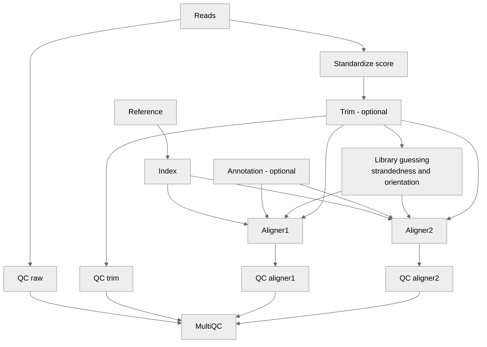

[](https://joss.theoj.org/papers/3691aa3dd83d8ccab8dfacce69c9b4c6)

AliNe (Alignment in Nextflow) - RNAseq DNAseq 
=========================================  
 

AliNe is a pipeline written in Nextflow that aims to efficiently align reads against a reference using the tools of your choice.  

Input: file, list of file, folder or csv  
Output: Coordinate sorted BAM/CRAM file. 

## Table of Contents

   * [Foreword](#foreword)
      * [Aligner and read types accepted](#aligner-and-read-types-accepted) 
      * [Aligner and library types accepted](#aligner-and-library-types-accepted)   
      * [Aligner and annotation](#aligner-and-annotation)
   * [Flowchart](#flowchart)
   * [Installation](#installation)
      * [Nextflow](#nextflow)
      * [Container platform](#container-platform)
        * [Docker](#docker)
        * [Singularity](#singularity)  
   * [Usage and test](#usage)
   * [Parameters](#parameters)
   * [Output](#output)
      * [Structure](#structure)
      * [Statistics](#statistics)
   * [Integrating AliNe in another nf pipeline](#integrating-aline-in-another-nf-pipeline)
   * [Contributing](#contributing)

## Foreword

**AliNe** is a pipeline written in Nextflow that aims to efficiently align reads against a reference.  

 * Can handle short reads paired or single, pacbio and ont (nanopore) data (see list of aligner in [Table 1](#aligner-and-read-types-accepted)).
 * A QC with FastQC is made at each step if option activated.  
 * A trimming is feasible before alignment if option activated.
 * **The pipeline deals automatically with all quality encoding ('sanger', 'solexa', 'illumina-1.3+', 'illumina-1.5+', 'illumina-1.8+').** All fastq will be standardised in Phred+33 for downstream alignments by seqkit.
 * Deal automatically with the type of library used: stranded or not, firstrand, secondstrand etc... (see list of aligner in [Table 2](#aligner-and-library-types-accepted)) 
 * Can deal with annotation file (see list of aligner in [Table 3](#aligner-and-annotation)) 
You can choose to run one or several aligner in parallel.

### Aligner and read types accepted

**Table 1** Here is the list of implemented aligners and the type of reads accepted:

| Tool	| Single End (short reads) | Paired end (short reads) | Pacbio | ONT |
| --- | --- | --- |  --- | --- |
| bbmap | ✅ | ✅ | ✅ use mapPacBio.sh  | ✅ use mapPacBio.sh |
| bowtie | ✅ | ✅ | ⚠️ | ⚠️ |
| bowtie2 | ✅ | ✅ | ⚠️ | ⚠️ |
| bwaaln | ✅ | ✅ R1 and R2 independently aligned then merged with bwa sampe | ⚠️ | ⚠️ |
| bwamem | ✅ | ✅ | ✅ | ✅ |
| bwamem2 | ✅ | ✅ | ✅ | ✅ |
| bwasw | ✅ | ✅ | ⚠️ | ⚠️ |
| graphmap2 | ⚠️ | ⚠️ R1 and R2 independently aligned then merged with cat | ✅ | ✅ |
| hisat2 | ✅ | ✅ | ⚠️ | ⚠️ |
| kallisto | ✅ | ✅ | ⚠️ | ⚠️ |
| last | ⚠️ | ⚠️ R1 and R2 independently aligned then merged with maf-convert | ✅ | ✅ |
| minimap2 | ✅ | ✅ | ✅ | ✅ |
| ngmlr | ⚠️ | ⚠️ R1 and R2 independently aligned then merged with cat | ✅ | ✅ |
| novoalign | ✅ | ✅ | ✅ | ⚠️ |
| nucmer | ✅ | ✅ R1 and R2 independently aligned then merged with cat | ⚠️ | ⚠️ |
| salmon | ✅ | ✅ | ⚠️ | ⚠️ |
| star | ✅ | ✅ | ✅ use STARlong | ✅ use STARlong |
| star 2pass mode | ✅ | ✅ | ⚠️ | ⚠️ |
| subread | ✅ | ✅ | ⚠️ | ⚠️ |
| sublong | ⚠️ | ⚠️ R1 and R2 independently aligned then merged with cat | ✅ | ✅ |

*Legend*  
✅ Recommended  
⚠️ Not recommended - It works but results might be sub-optimal (computing ressources might also be)  
🚫 Not applicable  

It is possible to bypass the default authorized read type using the AliNe --relax parameter.

### Aligner and library types accepted

The pipeline deals automatically with the library types. It extract 10 000 reads by default and run salmon to guess the library type. 
It is then translated to the correct option in the following aligners:

| Tool	| tool option | Library type by salmon | Comment | 
| --- | --- | --- | --- |
| bbmap | xs=fr / xs=ss / xs=us | ISF ISR / OSF OSR / U | strand information |
| bbmap | - / rcs=f / | ISF ISR IU / OSF OSR OU MSF MSR MU | read orientation |
| bowtie | --fr / --rf / --ff |  ISF ISR IU / OSF OSR OU / MSF MSR MU| read orientation |
| bowtie2 | --fr / --rf / --ff |  ISF ISR IU / OSF OSR OU / MSF MSR MU| read orientation |
| bwaaln | 🚫 | 🚫 | 🚫 |
| bwamem | 🚫 | 🚫 | 🚫 |
| bwamem2 | 🚫 | 🚫 | 🚫 |
| bwasw | 🚫 | 🚫 | 🚫 |
| dragmap | 🚫 | 🚫 | 🚫 |
| graphmap2 | 🚫 | 🚫 | 🚫 |
| hisat2 | --rna-strandness [ F / R / FR / RF ] | SF / SR / ISF OSF MSF / ISR OSR MSR | strand information |
| hisat2 | --fr / --rf / --ff | I / O / M | read orientation |
| kallisto | --fr-stranded / --rf-stranded | I / O | read orientation |
| last | 🚫 | 🚫 | 🚫 |
| minimap2 | 🚫 | 🚫 | 🚫 |
| ngmlr | 🚫 | 🚫 | 🚫 |
| novoalign | 🚫 | 🚫 | 🚫 |
| nucmer | 🚫 | 🚫 | 🚫 |
| salmon | U SR SF IU MU OU ISF ISR MSF MSR OSR OSF | identical | strand information and read orientation | 
| star | 🚫 | 🚫 | 🚫 |
| star 2pass mode | 🚫 | 🚫 | 🚫 |
| subread | -S fr / -S rf / -S ff | ISF ISR IU / OSF OSR OU / MSF MSR MU | read orientation |
| sublong | 🚫 | 🚫 | 🚫 |

*Legend*  
U unstranded; SR stranded reverse; SF stranded forward; IU inward unstranded; OU outward unstranded; MU matching unstranded; ISF inward stranded forward; ISR inward stranded reverse; OSF outward stranded forward; OSR outward stranded reverse; MSF matching stranded forward; MSR matching stranded reverse ([see herefor morde details](https://salmon.readthedocs.io/en/latest/library_type.html))  
🚫 Not applicable  

By default the `--library_type` is in auto mode and the pipeline will automatically detect the library type.  
You can also specify manually the library type to use via the `--library_type` parameter.  
If the `skip_libray_usage` paramater is set, the information about the library type—either provided by the user or inferred by the pipeline using the `--library_type` parameter—will be ignored.  
**Note:** If you explicitly specify the library type via the aligner parameter (e.g. `hisat2_options` for hisat2), that value will take precedence over any information provided or inferred using `--library_type`.

### Aligner and annotation

If you provide an annotation file the pipeline will pass automatically the file to the following aligner:  

| Tool	| accept | 
| --- | --- |
| bbmap | 🚫 |
| bowtie | 🚫 |
| bowtie2 | 🚫 |
| bwaaln | 🚫 |
| bwamem | 🚫 |
| bwamem2 | 🚫 |
| bwasw | 🚫 |
| dragmap | 🚫 |
| graphmap2 | GTF (--gtf)  |
| hisat2 | 🚫 |
| kallisto | 🚫 |
| last | 🚫 |
| minimap2 | 🚫 |
| ngmlr | 🚫 |
| novoalign | 🚫 |
| nucmer | 🚫 |
| salmon | 🚫 |
| star | GTF / GFF ( --sjdbGTFfile + --sjdbGTFtagExonParentTranscript Parent in case of GFF ) |
| star 2pass mode | GTF / GFF (--sjdbGTFfile + --sjdbGTFtagExonParentTranscript Parent in case of GFF ) |
| subread | GTF or compatible GFF format (-a) |
| sublong | 🚫 |

 *Legend*  
🚫 Not applicable  

## Flowchart



## Installation

The prerequisites to run the pipeline are:  

  * [Nextflow](https://www.nextflow.io/)  >= 22.04.0
  * [Docker](https://www.docker.com) or [Singularity](https://sylabs.io/singularity/)  

### Nextflow 

  * Via conda 

    <details>
      <summary>See here</summary>
      
      ```bash
      conda create -n nextflow
      conda activate nextflow
      conda install bioconda::nextflow
      ```  
    </details>

  * Manually
    <details>
      <summary>See here</summary>
      Nextflow runs on most POSIX systems (Linux, macOS, etc) and can typically be installed by running these commands:

      ```bash
      # Make sure 11 or later is installed on your computer by using the command:
      java -version
      
      # Install Nextflow by entering this command in your terminal(it creates a file nextflow in the current dir):
      curl -s https://get.nextflow.io | bash 
      
      # Add Nextflow binary to your user's PATH:
      mv nextflow ~/bin/
      # OR system-wide installation:
      # sudo mv nextflow /usr/local/bin
      ```
    </details>

### Container platform

To run the workflow you will need a container platform: docker or singularity.

### Docker

Please follow the instructions at the [Docker website](https://docs.docker.com/desktop/)

### Singularity

Please follow the instructions at the [Singularity website](https://docs.sylabs.io/guides/latest/admin-guide/installation.html)

## Usage

### Help

You can first check the available options and parameters by running:

```bash
nextflow run Juke34/AliNe -r v1.5.0 --help
```

### Profile

To run the workflow you must select a profile according to the container platform you want to use:   
- `singularity`, a profile using Singularity to run the containers
- `docker`, a profile using Docker to run the containers

The command will look like that: 

```bash
nextflow run Juke34/AliNe -r v1.5.0 -profile docker <rest of paramaters>
```

Another profile is available (/!\\ actually not yet implemented):

- `slurm`, to add if your system has a slurm executor (local by default) 

The use of the `slurm` profile  will give a command like this one:

```bash
nextflow run Juke34/AliNe -r v1.5.0 -profile singularity,slurm <rest of paramaters>
```

### Example

A typical command might look like the following.  
Here, we use the docker container platform, remote read and reference files, specify that we use single-ended short reads, list a number of aligners, enable trimming with fastp and provide specific options for the star aligner.

```bash
nextflow run Juke34/AliNe \
  -r v1.5.0 \
  -profile docker \
  --reads https://github.com/Juke34/AliNe/raw/refs/heads/main/test/illumina/yeast_R1.fastq.gz \
  --reference https://raw.githubusercontent.com/Juke34/AliNe/refs/heads/main/test/yeast.fa \
  --read_type short_single \
  --aligner bbmap,bowtie2,bwaaln,bwamem,bwasw,graphmap2,hisat2,minimap2,ngmlr,nucmer,star,subread,sublong \
  --trimming_fastp \
  --fastqc \
  --samtools_stats \
  --star_options "--genomeSAindexNbases 9"
```

## Test the workflow

Test data are included in the AliNe repository in the `test` folder.

Test with short single reads:

```bash
nextflow run -profile docker,test_illumina_single Juke34/AliNe -r v1.5.0
```

Test with short paired reads:

```bash
nextflow run -profile docker,test_illumina_paired Juke34/AliNe -r v1.5.0
```

Test with ont reads:

```bash
nextflow run -profile docker,test_ont Juke34/AliNe -r v1.5.0
```

Test with pacbio reads:

```bash
nextflow run -profile docker,test_pacbio Juke34/AliNe -r v1.5.0
```

On success you should get a message looking like this:

```
  AliNe Pipeline execution summary
    --------------------------------------
    Completed at : 2024-03-07T21:40:23.180547+01:00
    UUID         : e2a131e3-3652-4c90-b3ad-78f758c06070
    Duration     : 8.4s
    Success      : true
    Exit Status  : 0
    Error report : -
```

## Parameters

```
        --help                      prints the help section

    General Parameters
        --reads                     path to the reads file, folder or csv. If a folder is provided, all the files with proper extension in the folder   will be used. You can provide remote files (commma separated list).
                                    file extension expected : <.fastq.gz>, <.fq.gz>, <.fastq> or <.fq> 
                                                              for paired reads extra <_R1_001> or <_R2_001> is expected where <R> and <_001> are optional. e.g. <sample_id_1.fastq.gz>, <sample_id_R1.fastq.gz>, <sample_id_R1_001.fastq.gz>)
                                    csv input expects 6 columns: sample, fastq_1, fastq_2, strandedness, read_type and data_type. 
                                    fastq_2 is optional and can be empty. Strandedness, read_type and data_type expect same values as corresponding AliNe parameters; If a value is provided via AliNe parameter, it will override the value in the csv file.
                                    Example of csv file:
                                        sample,fastq_1,fastq_2,strandedness,read_type,data_type
                                        control1,path/to/data1.fastq.gz,,auto,short_single,rna
                                        control2,path/to/data2_R1.fastq.gz,path/to/data2_R2.fastq.gz,auto,short_paired,rna
        --reference                 path to the reference file (fa, fa.gz, fasta or fasta.gz)
        --aligner                   aligner(s) to use among this list (comma or space separated) [bbmap, bowtie, bowtie2, bwaaln, bwamem, bwamem2, bwasw, dragmap, graphmap2, hisat2, kallisto, minimap2, novoalign, nucmer, ngmlr, salmon, star, subread, sublong]
        --outdir                    path to the output directory (default: alignment_results)
        --annotation                [Optional][used by graphmap2, STAR, subread] Absolute path to the annotation file (gtf or gff3)

    Type of input reads
        --data_type                 type of data among this list [DNA, RNA] (no default)
        --read_type                 type of reads among this list [short_paired, short_single, pacbio, ont] (default: short_paired)
        --strandedness              Set the library_type of your reads (default: auto). In auto mode salmon will guess the library type for each sample.
                                    If you know the library type you can set it to one of the following: [U, IU, MU, OU, ISF, ISR, MSF, MSR, OSF, OSR]. See https://salmon.readthedocs.io/en/latest/library_type.html for more information.
                                    In such case the sample library type will be used for all the samples.
        --read_length               Length of the reads, if none provided it is automatically deduced. [Optional, used by STAR, Salmon, Kallisto]
        --seqtk_sample_size         Number of reads to sample from the input reads (default: 10000). The subsamples are used to guess strandedness and read_length. 
                                    Note that this step is not needed if the library type and strandedness are provided via AliNe parameters.

    Extra steps 
        --trimming_fastp            run fastp for trimming (default: false)
        --fastqc                    run fastqc on raw and aligned reads (default: false). Note: FastQC will be automatically disabled for alignment files when --cram is enabled.
        --samtools_stats            run samtools stats on aligned reads (default: false)
        --filter_unmapped           filter out unmapped reads from final alignment files (default: false). Filtering is performed during sorting when possible for optimal performance.
        --cram                      output alignment files in sorted CRAM format instead of sorted BAM (default: false). This saves disk space but disables FastQC on alignment files. Conversion is performed during sorting when possible for optimal performance.
        --multiqc_config            path to the multiqc config file (default: config/multiqc_conf.yml)

    Aligner specific options
        --bbmap_options             additional options for bbmap
        --bowtie_options            additional options for bowtie
        --bowtie2_options           additional options for bowtie2
        --bwaaln_options            additional options for bwaaln
        --bwamem_options            additional options for bwamem
        --bwamem2_options           additional options for bwamem2
        --bwasw_options             additional options for bwasw
        --dragmap_options           additional options for dragmap
        --graphmap2_options         additional options for graphmap2
        --hisat2_options            additional options for hisat2
        --kallisto_options          additional options for kallisto
        --kallisto_index_options    additional options for kallisto index
        --minimap2_options          additional options for minimap2 (default: -a (to get sam output))
        --minimap2_index_options    additional options for minimap2 index
        --ngmlr_options             additional options for ngmlr
        --novoalign_options         additional options for novoalign
        --novoalign_license         license for novoalign. You can ask for one month free trial license at http://www.novocraft.com/products/novoalign/
        --nucmer_options            additional options for nucmer
        --salmon_options            additional options for salmon
        --salmon_index_options      additional options for salmon index
        --star_options              additional options for star
        --star_index_options        additional options for star index
        --star_2pass                set to true to run STAR in 2pass mode (default: false)
        --subread_options           additional options for subread
        --sublong_options           additional options for sublong

    Other
        --monochrome_logs           set to true to disable color in logs (default: false)
        --relax                     set to true to disable aligner parameter changes made by AliNe (default: false) 

```

## Output


### Structure

Here the description of typical ouput you will get from AliNe:  

```
└── alignment_results                                         # Output folder set using --outdir. Default: <alignment_results>
    │
    ├── fastp                                                 # Folder - trimming with fastp (optional - if trimming activated by the user)
    │   ├── sample1_fastp_report.html                         # fastp report for sample1
    │   └── sample1_seqkit_trim.fastq.gz                      # sample1 trimmed fastq file
    │
    ├── seqkit_score                                          # Folder containing Sequencing scoring system detected with Seqkit
    │   └── sample1.result.txt                                # Information about scoring system detected in sample1 (Phred+33, Phred+64 and Solexa), and change applied
    │
    ├── mean_read_length                                      # Folder with mean read length computed in bash (optional - done if selected aligners need the info and no value provided by the user)
    │   └── sample1_seqkit_trim_sampled_read_length.txt       # Mean read length for sample1
    │
    ├── salmon_libtype                                        # Library information (read orientation and strand information) detected via Salmon
    │       └── sample1_lib_format_counts.json                # Library information detectected for sample1
    |
    ├── aline_updated_params
    |       └── sample1.txt                                   # File resuming the parameters automatically set by AliNe
    |
    ├── alignment                                             # Folder gathering all alignment output (indicies, sorted bam and logs)
    │   ├── aligner1                                          # Folder gathering data produced by aligner 
    │   │   ├── indicies                                      # Contains the reference index for the aligner
    │   │   │   └── ...                                       #
    │   │   ├── sample1_seqkit_trim_aligner1_sorted.log       # Ccontains the log of the aligner
    │   │   └── sample1_seqkit_trim_aligner1_sorted.bam       # Sorted bam output
    │   └── aligner2                                          # Folder gathering data produced by aligner 
    │       ├── indicies                                      # Contains the reference index for the aligner
    │       │   └── ...                                       # 
    │       ├── sample1_seqkit_trim_aligner2_sorted.log       # Contains the log of the aligner
    │       └── sample1_seqkit_trim_aligner2_sorted.bam       # Sorted bam output
    │
    ├─── samtools_stats                                       # Samtools stats folder
    │   ├── aligner1                                          # Folder with Samtools stats result for aligner1
    │   │   └── sample1_seqkit_trim_aligner1_sorted.txt       # Samtools stats file for sample1
    │   └── aligner2                                          # Folder with Samtools stats result for aligner2
    │       └── sample1_seqkit_trim_aligner2_sorted.txt       # Samtools stats file for sample1
    |
    ├── fastqc                                                # FastQC statistics folder
    │   ├── raw                                               # Folder with FastQC result for raw data
    │   │   └── fastqc_sample1_raw_logs                       # Folder with FastQC result for raw sample1 data
    │   │       ├── sample1_fastqc.html                       # FastQC interactive file summarizing the results of the analysis, with graphs and interpretations.
    │   │       └── sample1_fastqc.zip                        # Contains all the detailed data and graphics generated by FastQC
    │   └── trimming_fastp                                    # Folder with FastQC result for trimmed data (optional - if trimming activated by the user)
    │   │   └── fastqc_sample1_trimmed_logs                   # FastQC output folder for trimmed sample1 data
    │   │       ├── sample1_seqkit_trim_fastqc.html           # FastQC interactive file summarizing the results of the analysis, with graphs and interpretations.
    │   │       └── sample1_seqkit_trim_fastqc.zip            # Contains all the detailed data and graphics generated by FastQC
    │   ├── aligner1                                                 # FastQC output folder for data aligned with aligner1 
    │   │   └── fastqc_sample1_aligner1_logs                         # FastQC output folder for sample1 data aligned with aligner1 
    │   │       ├── sample1_seqkit_trim_aligner1_sorted_fastqc.html  # FastQC interactive file summarizing the results of the analysis, with graphs and interpretations.
    │   │       └── sample1_seqkit_trim_aligner1_sorted_fastqc.zip   # Contains all the detailed data and graphics generated by FastQC
    │   └── aligner2                                                 # FastQC output folder for data aligned with aligner2                      
    │       └── fastqc_sample1_aligner2_logs                         # FastQC output folder for sample1 data aligned with aligner2  
    │           ├── sample1_seqkit_trim_aligner2_sorted_fastqc.html  # FastQC interactive file summarizing the results of the analysis, with graphs and interpretations.
    │           └── sample1_seqkit_trim_aligner2_sorted_fastqc.zip   # Contains all the detailed data and graphics generated by FastQC
    │
    └── MultiQC                                               # MultiQC folder that aggregate results across many samples into a single report
        ├── multiqc_report.html                               # Report with interactive plots for statistics across many samples.
        └── multiqc_report_data                               # Plot and data used by the multiqc_report.html
```

### Statistics

#### FastQC

To compare the output of multiple aligners, you can enable the `--fastqc` parameter. AliNe will execute the FastQC program for each output file. Subsequently, all FastQC reports will be gathered into an HTML file using MultiQC. The resulting file, named `multiqc_report.html`, can be found in the `<output_directory>/MultiQC directory`. By default, the output directory is named `alignment_results`, but this can be customized using the `--outdir` parameter in AliNe.

FastQC collects the following information:  
  * Sequence Counts
  * Sequence Quality 
  * Per Sequence Quality Scores
  * Per Base Sequence Content
  * Per Sequence GC Content
  * Per Base N Content
  * Sequence Length Distribution
  * Sequence Duplication Levels 
  * Overrepresented sequences
  * Adapter Content

Among these metrics, "Sequence Duplication Levels", "Per Sequence GC Content" and "Sequence Count" are reported at the top of the `multiqc_report.html` file in a table called `General Statistics` as "% Dups", "%GC" and "M Seqs" accordingly ([see below](#general-statistics)).


#### Samtools stats

To compare the output of multiple aligners, you can enable the `--samtools_stats` parameter. AliNe will execute the Samtools stats program for each alignment file. Subsequently, all Samtools stats output will be gathered into an HTML file using MultiQC. The resulting file, named `multiqc_report.html`, can be found in the `<output_directory>/MultiQC directory`. By default, the output directory is named `alignment_results`, but this can be customized using the `--outdir` parameter in AliNe.

Samtools stats produces comprehensive statistics, see [here](http://www.htslib.org/doc/samtools-stats.html) for details.

Among all the produceds metrics, "Error rate", "Non-primary", "Reads mapped", "% Mapped", "Total seqs"" are reported at the top of the `multiqc_report.html` file in a table called `General Statistics` ([see below](#general-statistics)).  
These fields correspond to the following information : 

  * Error rate - The percentage of mismatches between the aligned reads and the reference (mismatches (NM) / bases mapped (CIGAR))
  * Non-primary - Non-primary alignments is the number of reads that are aligned to multiple locations in the reference.
  * Reads mapped - The number of reads that are successfully aligned to the reference.
  * % Mapped - The percentage of total reads that are mapped. Calculated from reads mapped / total sequences
  * Total seqs - The total number of reads in the BAM

#### General Statistics

Some information produced via FastQC or Samtools stats are reported at the top of the `multiqc_report.html` file in a table called `General Statistics` (see below):


In order to facilitate the reading of this `General Statistics` you can export the table in tsv using the `Export as CSV...` button and execute the following piece of R code on the downloaded `general_stats_table.tsv` file :

```R
# install packages
install.packages("dplyr")
install.packages("stringr")
install.packages("tidyr")
install.packages("knitr")

# Load necessary libraries
library(dplyr)
library(stringr)
library(tidyr)
library(knitr)

# Read the TSV file
file_path <- "general_stats_table.tsv"
df <- read.delim(file_path, check.names = FALSE)

# clean sample name to remove suffix _*_samtoolsstats
df$Sample <- df$Sample |> stringr::str_remove_all("_\\d+_samtoolsstats")

# sample name as row name
rownames(df) <- df$Sample

# remove Sample column and clean up the column names
tableout <- cbind(ID = rownames(df), stack(df[-1])) |> 
  transform(ind = as.character(ind) |> stringr::str_remove_all("\\.\\d+"))

# remove na values
tableout <- tableout[!is.na(tableout$values),]
# remove . values
tableout$values <- tableout$values |> stringr::str_remove_all("^\\.$")

# pivot data
tableout <- tableout |> pivot_wider(id_cols = ID , names_from = ind, values_from = values, 
              values_fn = \(x) paste(unique(x), collapse = ""))

# round each value to 4 decimals
tableout <- tableout |> mutate(across(-ID, ~round(as.numeric(.), 4)))

# print with nice output
knitr::kable(tableout)
```

You will get a table similar to this one:  

```
|ID                                  |    Dups| GC|   Seqs| Error rate| Non-primary| Reads mapped| % Mapped| Total seqs|
|:-----------------------------------|-------:|--:|------:|----------:|-----------:|------------:|--------:|----------:|
|yeast_R1                            | 73.0100| 43| 0.0100|         NA|          NA|           NA|       NA|         NA|
|yeast_R1_seqkit_STAR_sorted         | 73.2269| 43| 0.0101|     0.0000|       1e-04|       0.0001|   0.9600|      1e-02|
|yeast_R1_seqkit_bbmap_sorted        | 73.0100| 43| 0.0100|  2020.4080|       0e+00|       0.0001|   0.9900|      1e-02|
|yeast_R1_seqkit_bowtie2_sorted      | 73.0100| 43| 0.0100|    11.4698|       0e+00|       0.0001|   0.8600|      1e-02|
|yeast_R1_seqkit_bowtie_sorted       | 73.0100| 43| 0.0100|    49.5758|       0e+00|       0.0000|   0.3300|      1e-02|
|yeast_R1_seqkit_bwaaln_sorted       | 73.0100| 43| 0.0100|     0.0000|       0e+00|       0.0000|   0.0000|      1e-02|
|yeast_R1_seqkit_bwamem_sorted       | 72.9808| 43| 0.0100|     0.3760|       0e+00|       0.0019|  19.1400|      1e-02|
|yeast_R1_seqkit_bwasw_sorted        | 73.0289| 43| 0.0100|     0.2639|       0e+00|       0.0018|  18.3572|      1e-02|
|yeast_R1_seqkit_graphmap2_sorted    | 73.0100| 43| 0.0100|     0.0000|       0e+00|       0.0000|   0.0000|      1e-02|
|yeast_R1_seqkit_hisat2_sorted       | 73.0100| 43| 0.0100|     0.0000|       0e+00|       0.0000|   0.0400|      1e-02|
|yeast_R1_seqkit_kallisto_sorted     | 73.0100| 43| 0.0100|     0.0000|       0e+00|       0.0018|  18.1000|      1e-02|
|yeast_R1_seqkit_minimap2_sorted     | 73.2885| 43| 0.0101|     0.3212|       1e-04|       0.0003|   2.5200|      1e-02|
|yeast_R1_seqkit_nucmer.fixed_sorted | 64.7399| 42| 0.0002|     0.2809|       0e+00|       0.0002| 100.0000|      2e-04|
|yeast_R1_seqkit_sublong_sorted      | 45.2600| 43| 0.0100|     0.0000|       0e+00|       0.0012|  12.3400|      1e-02|
|yeast_R1_seqkit_subread_sorted      | 73.0100| 43| 0.0100|     0.1396|       0e+00|       0.0016|  15.6000|      1e-02|
```

## Integrating AliNe in another nf pipeline

In Nextflow it is possible to call external workflow like AliNe from another workflow.
This require to write a dedicated process that will call AliNe and get back the results.
A complete guide how to do so is available [here](https://github.com/mahesh-panchal/nf-cascade?tab=readme-ov-file)

## Contributing

Contributions from the community are welcome ! See the [Contributing guidelines](https://github.com/Juke34/aline/blob/main/CONTRIBUTING.md)
