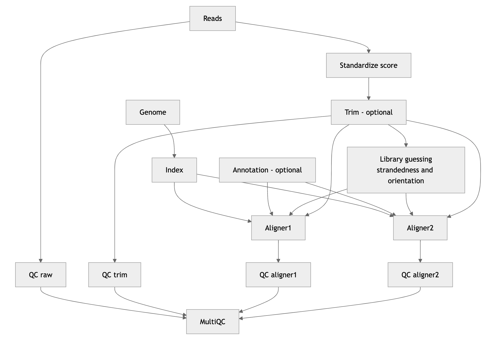

---
title: 'AliNe: A Flexible and Efficient Nextflow Pipeline for Read Alignment'
tags:
  - Nextflow
  - RNA-seq
  - Alignment
authors:
  - name: Jacques Dainat
    orcid: 0000-0002-6629-0173
    affiliation: 1
affiliations:
 - name: Joint Research Unit for Infectious Diseases and Vectors Ecology Genetics Evolution and Control (MIVEGEC), University of Montpellier, French National Center for Scientific Research (CNRS 5290), French National Research Institute for Sustainable Development (IRD 224), 911 Avenue Agropolis, BP 64501, 34394 Montpellier Cedex 5, France.
   index: 1
date: 17 September 2024
bibliography: paper.bib
---

# Summary

Alignment of sequencing reads against a reference genome is a fundamental step in many bioinformatics workflows. Aligner performance varies by speed, memory efficiency, and accuracy, with some tailored to specific sequencing technologies and others more versatile, which makes the selection of an appropriate tool context-dependent. To streamline this process, we present AliNe (Alignment in Nextflow), a flexible and efficient read alignment pipeline built on the Nextflow framework [@nextflow]. AliNe contains a broad range of commonly used aligners and is designed to accommodate any high-throughput sequencing projects.

AliNe supports short reads (both paired-end and single-end) as well as long reads generated by PacBio and Oxford Nanopore Technologies (ONT). It is designed to minimize user inputs and avoid common parameter mistakes (e.g., scoring system, strandedness, orientation). Currently, AliNe supports 16 widely used alignment tools, including BBMap [@bbmap], Bowtie [@bowtie], Bowtie2 [@bowtie2], BWA [@bwaaln], BWA-MEM [@bwamem], BWA-SW [@bwasw], GraphMap2 [@graphmap2], HISAT2 [@hisat2], Kallisto [@kallisto], Minimap2 [@minimap2], ngmlr [@ngmlr], novoAlign [@novoalign], nucmer [@nucmer], STAR (single or two-pass mode) [@star], subread [@subread], and sublong [@subread]. These aligners are integrated into a single, easy-to-use workflow, providing a unified entry point for any project requiring alignment and giving users the flexibility to choose the tool that best suits their specific data and objectives. To facilitate aligner comparison, AliNe provides a comprehensive set of metrics, including computational resource usage (CPU, memory, runtime, and disk I/O) reported by Nextflow, as well as alignment statistics generated by FastQC [@fastqc] and Samtools stats [@samtools].

# Statement of Need

The complexity of sequencing data analysis, especially with the advent of next-generation sequencing (NGS), has created a demand for robust, scalable, and reproducible workflows that can handle large datasets while allowing users to flexibly choose their preferred analysis tools. Numerous bioinformatics analyses rely on the quality of read alignment, having a major role in the reliability of the downstream results. Each alignment tool has its own strengths and weaknesses. Users may need to try out several alignment tools in order to achieve optimal results specific to the project's requirements. AliNe empowers researchers with a single-entry point for alignment, eliminating the need to juggle between disparate tools. By integrating multiple aligners into a unified pipeline, AliNe simplifies the process of alignment algorithm selection and establishes a standardized workflow that ensures both reproducibility and transparency across analyses.

Majority of pipelines integrating read alignment steps are tailored to specific sequencing technologies and types of analyses [@tronflow] [@nfcorernaseq] [@sarek] [@readmapping]. There remains a lack of unified, versatile workflows capable of integrating aligners into a single, user-friendly platform. AliNe addresses this challenge by providing a comprehensive, streamlined solution for alignment tasks across a wide range of sequencing technologies, whatever the field of application. 
Furthermore, leveraging the concept of daisy-chaining Nextflow workflows [@nfcascade], AliNe can be integrated as a sub-workflow within other Nextflow pipelines [@daisychainingaline], providing a standardized alignment step while offering a diverse selection of alignment tools.

# Workflow Overview

AliNe takes sequencing reads in FASTQ format and aligns them to a user-supplied reference genome in FASTA format, using user-selected aligners.
The workflow is fully configurable to accommodate various data types and gives users the ability to fine-tune tool alignment parameters independently. Nevetheless, AliNe is designed to minimize user inputs and avoid common mistakes like the definition of scoring system used by the sequencing machine (Phred+33, Phred+64, and Solexa) or, in the case of RNAseq data, the strandedness (stranded or unstranded) or the orientation in case of paired-end reads (forward reverse i.e., fr; reverse forward i.e., rf; forward forward i.e., ff). If not provided by the user, AliNe will deduce this information and adapt the option of the different downstream aligners accordingly. AliNe suggests also a proper aligner, depending on the input data provided.

To run AliNe you need to select one or several aligners and specify the type of input data: short single-end reads, short paired-end reads, long reads generated by PacBio or long reads generated by Oxford Nanopore Technologies (ONT).
AliNe integrates an optional read trimming step using Fastp [@fastp]. 
It also includes optional quality control at every stage with FastQC [@fastqc]. For RNA-seq data, the pipeline automatically detects the library type (strandedness and orientation) via Salmon [@salmon] and configures the appropriate parameters for downstream alignment tools accordingly.
Additionally, AliNe uses SeqKit [@seqkit] to detect the sequence quality scoring system and standardizes it to Phred+33 if necessary. Once preprocessing is complete, alignment is performed using the aligners selected by the user. Finally, with the help of Samtools [@samtools], AliNe outputs the aligned reads in sorted BAM format, ready for downstream analyses such as variant calling, gene expression quantification, or structural variation detection.
The final stage resumes all FastQC analyses and logs output from compatible aligners using MultiQC [@multiqc]. 
All these steps are summarized in Figure 1.

The pipeline supports parallel execution, ensuring efficient processing of large datasets by distributing tasks across available CPU cores. With Nextflow's inherent support for reproducibility, users can confidently rerun analyses with consistent results.

The pipeline is modular, enabling future expansion and the integration of additional tools or customization of downstream analysis steps. Users can adapt AliNe to their specific research needs, whether for RNA-seq, ChIP-seq, or whole-genome resequencing projects.

# Availability

AliNe is freely available under an open-source license. The source code, along with detailed documentation and examples, can be found at [https://github.com/Juke34/AliNe](https://github.com/Juke34/AliNe). Contributions and community feedback are welcome.

# References

